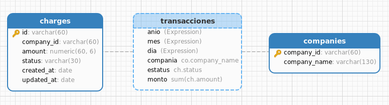
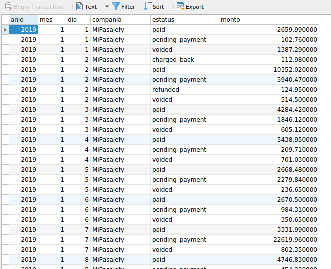

# Prueba técnica: Data Engineer

### Pre-Requisitos
* python3.7
* postgresql 11

Uno o dos párrafos sobre tu producto y el problema que resuelve.


## Instalación

Linux:

```
python3 -m virtualenv spark  
source spark/bin/activate 
```

### Instalar paquetes necesarios para Spark
Antes de descargar y configurar Spark, debe instalar las dependencias necesarias. Este paso incluye la instalación de los siguientes paquetes:
* JDK
* Scala
* Git

Abra una ventana de terminal y ejecute el siguiente comando para instalar los tres paquetes a la vez:
```
sudo apt install default-jdk scala git -y
```
Una vez que se completa el proceso, verifique las dependencias instaladas ejecutando estos comandos:
```
java -version; javac -version; scala -version; git --version
```
### Descargue y configure Spark en Ubuntu

Ahora, debe descargar la versión de Spark que desee. Optaremos por Spark 3.0 con Hadoop 2.7 .

Utilice el wget comando y el enlace directo para descargar el archivo Spark:

```
wget https://downloads.apache.org/spark/spark-3.0.0/spark-3.0.0-bin-hadoop2.7.tgz
```
Ahora, extraiga el archivo guardado usando el tarcomando:

```
tar xvf spark-*
```

Finalmente, mueva el directorio descomprimido spark-3.0.0-bin-hadoop2.7 al directorio opt / spark .

Utilice el mvcomando para hacerlo:

```
sudo mv spark-3.0.0-bin-hadoop2.7 /opt/spark
```
### Descargue y configure Spark en Ubuntu
Use el echocomando para agregar estas tres líneas a .profile :

```
echo "export SPARK_HOME=/opt/spark" >> ~/.profile
echo "export PATH=$PATH:$SPARK_HOME/bin:$SPARK_HOME/sbin" >> ~/.profile
echo "export PYSPARK_PYTHON=/usr/bin/python3" >> ~/.profile
```

### Instalar librerias necesarias de python 
Ejecutar los comandos siguientes:

```
pip install -r requirements.txt 
```


## Sección 1: Data pipeline (Detalle de la soluci&oacute;n)
> Objetivo: Crear un data pipeline con las herramientas disponibles por el usuario

* 1.1 Carga de información -----
> Resources: El file donde se ejecuta el proceso -> data_prepare.py
La base de datos que se eligió fue MongoDB, ya que al ser una BD no relacional se puede tener un a mejor manejo de la información antes de que ser transformada, además de que si los datos llegarán a crecer mucho , esta base cuenta con buena escalabilidad y flexibilidad.

* 1.2 Extracción -----
> Resources: El file donde se ejecuta el proceso -> data_prepare.py
En este paso se utilizó la herramienta de Apache Spark con el lenguaje de Python para la extracción de los datos y guardado en un archivo tipo parquet, el cual se eligió ya que por el formato de columnas que manejan ayuda eficientemente a poder interactura con los datos, además  que reduce espacio y mejora performance.


* 1.3 Transformación -----
> Resources: El file donde se ejecuta el proceso -> data_process.py
En este proceso el reto principal fue lograr una buena integridad mediante limpieza de campos, ya que se encontraron campos con id vacios, numeros infinitos, datos duplicados y mal escritos y era bastante importante ya que el destino era el modelo SQL.

* 1.4 Dispersión de la información ------
> Resources: El file donde se ejecuta el proceso -> data_process.py
En este paso se  requeria  un esquema estructurado que involucrara la información de las transacciones y la información de las compañias para los datasets. El diagrama e muestra a continuación



* 1.5 SQL------
> Resources: El data de la vista se encuentra en resorces -> transacciones.csv y el script  resorces -> data_transancciones.sql
Se diseño una vista en la base de datos Postgres de las tablas donde cargamos la información transformada donde muestra el  monto total transaccionado por día para las diferentes compañías



### Pasos para ejecutar los procesos
Ejecutar los comandos siguientes:

```
 python3 data_prepare.py --file ./data/data_prueba_tecnica.csv    

 python3 data_process.py
```

## Sección 2: Aplicación Python
> Objetivo: Calcular el número faltante de un conjunto de los primeros 100 números naturales del cual se extrajo uno.

### Especificaciones del problema

- La aplicación debe de implementarse en el lenguaje Scala
- Se debe de implementar una clase que represente al conjunto de los primero 100 números
- La clase implementada debe de tener el método Extract para extraer un cierto numero deseado
- La clase implementada debe de poder calcular que numero se extrajo y presentarlo
- Debe de incluir validación del input de datos (numero, numero menor de 100)
- La aplicación debe de poder ejecutarse con un argumento introducido por el usuario que haga uso de nuestra clase y muestre que pudo calcular que se extrajo ese número

Ejecutar los comandos siguientes para poder probar la aplicación:

* El argumento numero_variable seŕa el variable.

```
py app_numeros.py --numero numero_variable      
```


spark-shell --packages  org.postgresql:postgresql:9.4.1207.jre7 

## Autor

* **Maria Valdes Moreno**

